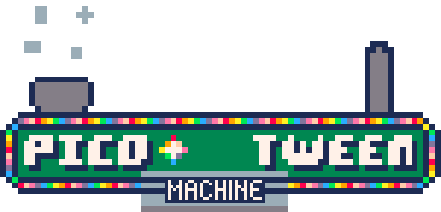
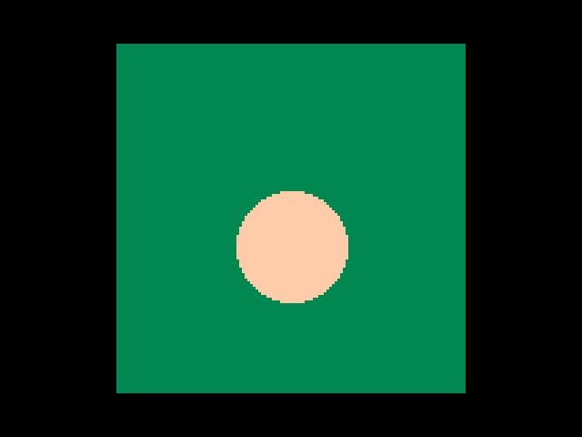
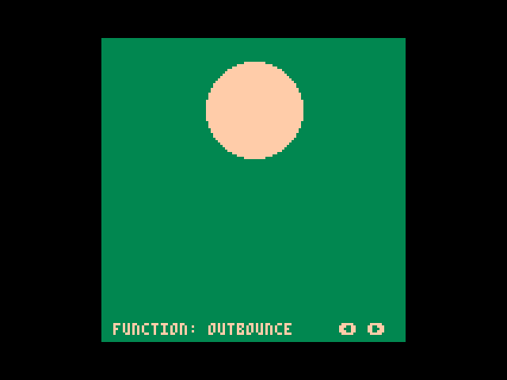
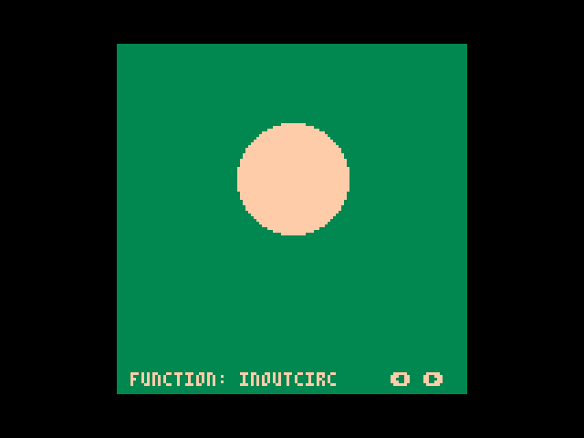

**PICO-TweenMachine** is a small wrapper utility for the **PICO-8** fantasy console, meant as an extension for another library of mine - [PICO-Tween](https://github.com/JoebRogers/PICO-Tween).

The original library simply provided a collection of tweening/easing functions, and their math dependencies for use in your code. This extension exists as a lightweight wrapper to drive all tween related code in clean and clear manner, reducing the boilerplate and mess nestled within your codebase. 

This library currently sits at **239** tokens, not including any actual tweening/easing functions.

Whilst the intent for this library is as an extension to my own port of tweening functions for the **PICO-8**, it is completely dependency free, and will be completely compatible with any of your own tweening functions provided that they take arguments in the same way as traditional **Robert Penner** styled tweens.

## Setup

Like any PICO-8 library, integrating this library into your cart is as simple as copy/pasting the source
into the top of your code (I recommend the top in order to avoid problems with object ordering).

If you plan on using your own tweening code, then simply follow the examples provided for setting up tweens in the **Basic Usage** section.

If you'd like to use the library as intended, then grab it from the [PICO-Tween](https://github.com/JoebRogers/PICO-Tween) repository and follow the setup advice there for functions to grab for your usage.

## Basic Usage

After copying over the sources to your cart, using a tween with the library is very simple. You simply need to call the `tween_machine:add_tween` function, passing the fields you'd like to set as an object. The add tween function also returns an instance of the tween, which should be stored somewhere in order to remove it from the wrapper at any point, or for polling the current value of the tween. Any code that you want to call during each step of the tween or after the tween has finished running can be registered as callbacks with the `__tween:register_step_callbacks` and `__tween:register_finished_callbacks` functions.

Here's a small example showing how this can be used in action (assuming the wrapper has been pasted to the top of the cart):

```lua 
function linear(t, b, c, d)
  return c * t / d + b
end

local move_distance = 30
local move_duration = 1
local easeprop = 0

function set_ball_position(position)
    easeprop = position
end

function reverse_ball_direction(tween)
    tween.v_start = tween.v_end
    tween.v_end = -tween.v_end
    tween:restart()
end

function _init()
    ball_tween = tween_machine:add_tween({
        func = linear,
        v_start = -move_distance,
        v_end = move_distance,
        duration = move_duration
    })
    ball_tween:register_step_callback(set_ball_position)
    ball_tween:register_finished_callback(reverse_ball_direction)
end

function _update()
  tween_machine:update()
end

function _draw()
  rectfill(0, 0, 128, 128, 3)
  circfill(64, 60 + easeprop, 20, 15)
end
```

You should get the following results:



## Examples

You can find a test cart that allows you to cycle through all of the easing functions in the [cart](cart/pico-tween-machine-demo.p8) folder 
if you want to load it up into the console and play around with it!

Here are some example gifs:



